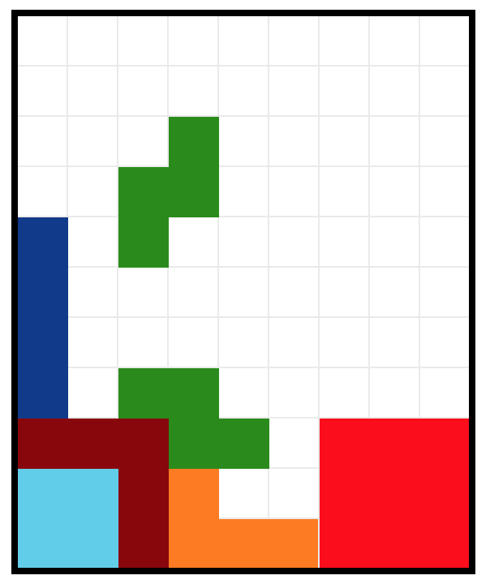

# Пробуем таблицы

## Задача 1

Сверстать с помощью таблиц скриншот игры:

## Задача 2

Сверстать с помощью таблицы квадратик, похожий на сайт

## Задача 3

Сверстать с помощью табличной верстки один из шаблонов для писем.
Например, отсюда

* [сумасшедшая сборка из 10-и качественных писем](http://bayguzin.ru/main/shablonyi/shablonyi-e-mail-rassyilki/email.html)
* [Beautiful emails to help inspire your next email design.](http://htmlemaildesigns.com/)
* [email gallery](http://www.email-gallery.com/)
* [Good emails gallery](https://reallygoodemails.com/)

