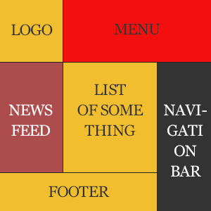

# Simple Layout

1. Logo should be `100x100px`
1. The menu should fill all other space in a row, never mind what the screen is, height also `100px`
1. Newsfeed should be `100x300px`
1. List and Newsfeed should take all available width, height `300px`
1. The Navigation bar should take `35%` width of top menu and height `450px`
1. The footer should take all the free space under the Newsfeed and list, and have `150px` height
1. (*) Stretch the grid vertically(Holy Grail problem), so the website will cover full viewport. Forget about the rule "List should have 300%", it should stretch to all available vertical space.

Note: Pick some interesting colors from [Adobe Color CC](https://color.adobe.com/explore/?filter=most-popular&time=all) and make blocks colorful.
